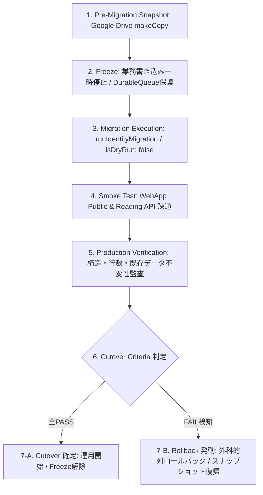

# 汎用POSTING MAP 再構築 実装計画書
## Universal POSTING MAP Engineering Master Plan — Revised Unified Edition

> **本書は、汎用POSTING MAPの再構築における最上位実装計画・設計契約・実装開始ゲートを一つに統合したマスタープランである。**
>
> 本書に記載された思想・不変条件・責務境界・実装順序・検証基準を、実装者およびAI開発者が従うべき基準とする。

---

# 0. 最上位憲法

## 0.1 汎用POSTING MAPの基本単位

汎用POSTING MAPは、地域ごとに別アプリを作る製品ではない。

### 物理構成の不変条件

- **単独アプリ**
- **単独リポジトリ**
- **単独ドメイン**

この1つのPOSTING MAPを共通基盤として、地域・支部・対象地域等の差異は**データとして分離**する。

```text
                    汎用POSTING MAP
                          │
        ┌─────────────────┼─────────────────┐
        │                 │                 │
     単独アプリ       単独リポジトリ      単独ドメイン
        │                 │                 │
        └─────────────────┼─────────────────┘
                          │
                  共通アプリケーション
                          │
             ┌────────────┴────────────┐
             │                         │
          Hアプリ                  Dashboard
        （現場活動）                （観測）
             │                         │
             └────────────┬────────────┘
                          │
                    共通API / Backend
                          │
                     共通データモデル
                          │
             ┌────────────┴────────────┐
             │                         │
          地域Aデータ                地域Bデータ
          支部・対象地域             支部・対象地域
```

### 4層物理分離アーキテクチャ (4-Tier Physical Separation)

汎用POSTING MAPは、以下の4つの独立した物理層によって構成される。

```text
┌────────────────────────────────────────────────────────────────────────┐
│ Layer 1: Client UI Layer (H-App / Dashboard)                           │
│  - ブラウザ / PWA 環境 (Vanilla JS / CSS / HTML)                       │
│  - No Secrets in Frontend: 認証シークレットや業務データを直接保持しない  │
└───────────────────────────────────┬────────────────────────────────────┘
                                    │ HTTPS POST (API Request)
                                    ▼
┌────────────────────────────────────────────────────────────────────────┐
│ Layer 2: API Gateway Layer (Universal Standalone GAS Web App)          │
│  - 単一 Web App URL によるマルチテナント集中ルーティング               │
│  - LINE LIFF 検証 / サーバーサイドセッション管理 / 悲観的排他ロック    │
│  - 全業務ロジック・入力検証・集計責務の集中実行                        │
└─────────────────┬────────────────────────────────────┬─────────────────┘
                  │                                    │
                  ▼                                    ▼
┌──────────────────────────────────┐ ┌───────────────────────────────────┐
│ Layer 3: Storage Layer           │ │ Layer 4: Pure Database Layer      │
│  - Google Drive (原本ファイル)   │ │  - Google Spreadsheet (純粋DB)    │
│  - 配布証跡写真 (Photo Files)    │ │  - Script / Trigger / 関数埋込禁止│
│  - GeoJSON 境界データ            │ │  - 単純な行・列データ保持に特化   │
└──────────────────────────────────┘ └───────────────────────────────────┘
```

### Pure DB の絶対原則 (ADR-001)
- スプレッドシート（Layer 4）内に Apps Script、カスタム関数（`=QUERY`, `=IMPORTRANGE` 等の動的集計）、トリガーを配置することを永久に禁止する（Container-bound Apps Script 永久廃止）。
- 集計・計算責務はすべて Layer 2（Standalone GAS）が担い、Spreadsheet は純粋な RDBMS / ストレージとして機能させる。これにより他地区への完全な可搬性とバージョン管理容易性を担保する。

### 絶対に採用しない構造

```text
地域A → 別アプリ
地域B → 別アプリ

地域A → 別リポジトリ
地域B → 別リポジトリ

地域A → 別ドメイン
地域B → 別ドメイン
```

地域展開のためにコードベースを複製する設計にはしない。


---

# 1. 再構築の目的

## 1.1 唯一の目的

本再構築は「新しいPOSTING MAPを発明する」ものではない。

現行Hアプリで確立された、

- 思想
- 利用者体験
- 基本操作
- 地域構造

を基準として継承し、後付け機能・技術的負債・バグ・暫定実装によって複雑化した内部実装を、汎用POSTING MAPとしてクリーンに再構築する。

### 継承対象

> 現行Hアプリで確立された利用者体験・思想・基本操作を基準として継承する。

### 継承しないもの

- 意図しない挙動
- バグ
- 暫定実装
- 重複ロジック
- ゾンビコード
- 技術的負債
- 管理都合によって後付けされた不適切な構造

---

# 2. AI・実装者に対する変更契約

## 2.1 最優先ルール

実装者・AI・将来の開発者が、

- 「より便利」
- 「より高度」
- 「一般的にはこうする」
- 「ついでに整理」
- 「リファクタリングした方がよい」

という理由で、本計画にない変更を行うことを禁止する。

**「改善」は変更理由にならない。**

## 2.2 実装前宣言

各実装単位では、事前に以下を明示する。

1. 対象ファイル
2. 対象関数・対象ブロック
3. 変更内容
4. 変更理由
5. 変更しない範囲
6. 関連するREQ / DESIGN / ADR
7. 検証方法

## 2.3 実装後監査

必ず以下を実施する。

- diff確認
- `git diff --check`
- 変更範囲監査
- テスト
- API境界確認
- 必要な実機確認
- 本番反映確認

新コードが旧コードを置き換える場合、旧ロジックを残して二重実装にしない。

---

# 3. POSTING MAPの利用者・責務

## 3.1 Hアプリ

**現場の党員が活動するためのアプリ。**

基本思想：

> 配布員は操作する。管理者は見る。

Hアプリでは、党員本人が自分の生活圏・都合に合わせて活動場所を選択できる。

## 3.2 Dashboard

管理者・運営側が地域全体を観測するための画面。

- PC：MAP中心のOverview
- スマートフォン：コンパクトOverview
- 詳細画面選択時：その画面を主画面化・必要に応じてFullscreen

Dashboardは現場への個別タスク割当を目的としない。

---

# 4. 党員と地域の関係

## 4.1 正しい関係

```text
LINE User ID（署名検証）
        ↓
本人（Staff Identity）
        ↓
所属支部（Branch）
        ↓
支部の活動対象地域
        ↓
本人が活動場所を選択
        ↓
活動実績
        ↓
個人ランキング
```

## 4.2 存在しない関係

```text
党員 ──×──> 担当エリア
Branch ──×──> AllowedActivityRegion ──×──> Person (活動地域強制モデルの禁止 - ADR-002)
```

党員個人に「担当エリア」は存在しない。また、所属支部の対象地域によって個人の活動可能地域を強制・制限するモデルは全面的に禁止する。

したがって、

- 担当エリアID
- 担当者コード
- 個人への固定エリア割当
- 担当枠
- 支部単位の活動地域アクセス制限フィルター

をデータモデルおよびAPIへ導入しない。党員は任意の町丁目を自律的に選択して活動できる。

## 4.3 個人ランキングは存在する

個人ランキングは正式な機能として実装対象とする。

ランキングは、

- 活動実績
- 活動量
- 継続活動
- その他、正式に定義した活動指標

を可視化するための機能とする。

ただしランキングを、

- 個人ノルマ
- 強制参加
- 出勤管理
- 人事評価
- 管理者による活動強制

へ変換しない。

## 4.4 PinStatus と DistributionRecord の厳格な分離 (ADR-005)

システム内の状態管理において、リアルタイムの作業中表示と永続化された実績記録を明確に分離する。

- **PinStatus (作業中排他シグナル - `PinStatus` シート)**:
  - 当日中の他党員による重複着手を自然防止するための「一時的・揮発的な作業中マーカー」。
  - 配布完了（`updateRecordWithGPSPhoto`）時、またはタイムアウト（当日中）によって自動解除される。
  - 実績データではなく、監査証跡としての永続性を持たない。
- **DistributionRecord (配布実績監査台帳 - `配布実績YYYY-MM` シート)**:
  - 完了したポスティング活動の事実（町丁目、枚数、スタッフ、GPS、写真URL）を記録する「追記専用（Append-Only）の不変台帳」。
  - `rowId` を重複拒否キーとしてはならず、別日・同日の正当な追加配布をすべて独立レコードとして受容する。


---

# 5. 不変条件

## INV-001：本人性

LINE User IDを本人性確認の基礎とする。

## INV-002：所属支部

所属支部はサーバー側で本人性確認後に導出する。

クライアントが送信する`branchId`を権限根拠として信用しない。

## INV-003：担当エリアなし

党員への固定担当エリア概念は存在しない。

## INV-004：個人ランキングあり

活動実績から個人ランキングを生成できる。

## INV-005：lineUserId秘匿

`lineUserId`をフロントエンドの、

- LocalStorage
- Cookie
- DOM
- URL

へ平文で露出させない。

## INV-006：オフライン継続

通信断でも現場操作を停止させない。

## INV-007：冪等性

活動登録は`clientEventId`等の冪等キーによって重複登録を防止する。

## INV-008：単独製品

POSTING MAPは単独アプリ・単独リポジトリ・単独ドメインとして維持する。

## INV-009：地域差はデータ

地域展開時の差異は、原則として地域データ・設定・マスターデータとして扱い、地域ごとにアプリコードを複製しない。

---

# 6. IN / OUT

| 領域 | IN SCOPE | OUT OF SCOPE |
|---|---|---|
| 現場活動 | 活動入口、地域MAP、ポスティング、活動ログ、物資所在情報 | 固定担当エリア、個人ノルマ、出勤管理、活動強制 |
| 個人可視化 | 活動実績、個人ランキング | 人事評価、強制順位付け |
| 位置・通信 | 最小限の操作、オフライン保持、復帰後再送 | 常時GPS、常時位置追跡、バックグラウンド監視 |
| 管理 | Dashboardによる地域全体の観測 | 個人への活動場所強制割当 |
| 製品構造 | 単独アプリ・単独repo・単独domain | 地域別アプリ・地域別repo・地域別domain |
| SNS | 必要な外部導線 | SNSそのものの代替 |

---

# 7. 責務境界

## Hアプリ

### 決めてよい

- 本人が選択した活動場所
- 本人が実施した活動事実
- 活動ログ送信

### 決めてはいけない

- 自分の所属支部
- 自分の権限
- 自分の担当エリア
- 他人の本人性

## Standalone GAS API

### 決めてよい

- 本人性
- 所属支部
- 入力検証
- 権限確認
- DB書き込み
- 冪等性
- エラー返却

### 決めてはいけない

- HTML UIの返却
- クライアント状態の勝手な強制変更

## Spreadsheet

Pure DBとして扱う。

- スクリプト内包なし
- トリガー依存なし
- 業務ロジック依存なし

## Dashboard

- 地域全体の観測
- 進捗可視化
- 物資状況
- 手薄地域等の可視化
- 個人ランキングの観測

を行う。

現場個人への固定担当割当は行わない。

---

# 8. 要件トレーサビリティ

すべての実装は、

```text
REQ
 ↓
DESIGN / INVARIANT
 ↓
UI
 ↓
API
 ↓
TEST
 ↓
EVIDENCE
```

で追跡可能にする。

上流要求に紐付かないコード追加は実装対象にしない。

---

# 9. データ設計

## 9.1 データ辞書

`docs/data/DATA_DICTIONARY.md`

全項目について以下を定義する。

- 物理名
- 論理名
- 型
- 制約
- SSOT
- 作成主体
- 更新主体
- 必須/任意
- 個人情報区分
- 保持期間
- ライフサイクル
- 関連REQ/ADR

## 9.2 基本データ

少なくとも以下を設計対象とする。

- branchId
- areaId
- activityId
- clientEventId
- clientCreatedAt
- serverReceivedAt
- Staff Identity
- 活動実績
- ランキング集計用データ

### 禁止

党員個人に固定担当エリアを持たせる列を作らない。

---

# 10. 活動ログライフサイクル

```text
未操作
 ↓
操作受付
 ↓
ローカル保存
 ↓
同期待ち
 ↓
送信中
 ├→ 送信失敗 → 同期待ち
 └→ サーバー受付
       ↓
     確定
```

恒久エラーは要確認状態へ隔離する。

---

# 11. 冪等性

端末側で活動送信ごとに一意の`clientEventId`を生成する。

サーバーは同一キーを受信した場合、

- DB二重書込をしない
- 成功として扱える場合はduplicate=true等で返却
- クライアントが安全に再送できる

ことを保証する。

---

# 12. API契約

基本プロトコル：

- HTTPS
- POST
- JSON Request / JSON Response
- Authorization
- サーバー側本人性導出
- 入力検証
- 権限検証
- 冪等性
- エラーコード
- retryable判定

実際の既存API名・実際の認証方式・実際のSpreadsheet列は、現行Hアプリ構造台帳で確認してから確定する。

本書のAPI名・フィールド名は、確定前の例示を実装仕様として扱わない。

---

# 13. 現場UX契約

1. 待たせない
2. 圏外でも止めない
3. 迷わせない
4. 疲れさせない
5. 何もしないで閉じても正常
6. 活動場所を本人が自由に選択できる
7. 操作は可能な限り少ない
8. 地図を中心にする
9. 常時監視を行わない

---

# 14. 性能契約

測定点をT0〜T5として固定する。

```text
T0 URL / LIFF起動
 ↓
T1 基本UI描画
 ↓
T2 ローカル状態・主要UI展開
 ↓
T3 地図コンテナ確定
 ↓
T4 地図・ピン操作可能
 ↓
T5 最新差分同期完了
```

目標：

- Warm Start：T2 ≤ 200ms
- Cold Start：T2 ≤ 800ms
- Offline：T2 ≤ 200ms

数値は実機計測によって検証する。

---

# 15. 障害モデル

最低限、以下を試験対象とする。

1. 通信遮断
2. APIタイムアウト
3. API 500 / GASクラッシュ
4. GASクォータ超過
5. Spreadsheet同時書込
6. 認証期限切れ
7. 地図API障害
8. ブラウザ強制終了・電池切れ
9. ストレージ圧迫
10. 同時活動
11. 重複送信

基本原則：

> 障害が発生しても、現場ユーザーの「活動した」という事実を可能な限り失わない。

---

# 16. アクセシビリティ

- 色だけに依存しない
- 状態は形状・アイコン・文字等を併用
- タップ領域は原則48px以上
- 通信状態・同期状態を誤認させない

---

# 17. ADR

`docs/architecture/decisions/`

最低限以下を管理する。

- ADR-001 LINE Identity
- ADR-002 Standalone GAS API
- ADR-003 Spreadsheet Pure DB
- ADR-004 Hアプリ / Dashboard分離
- ADR-005 共通エンジン / 地域データ分離
- ADR-006 Offline Queue / Idempotency
- ADR-007 Google Maps Loader
- ADR-008 担当エリアなし・自律選択モデル
- ADR-009 単独アプリ / 単独リポジトリ / 単独ドメイン
- ADR-010 個人ランキング

---

# 18. 桑名の教訓

`docs/architecture/02_LESSONS_FROM_KUWANA.md`

確認済み事故・根本原因・影響・検出・再発防止・検証方法を統一フォーマットで記録する。

主な教訓：

1. Identity直列化による起動遅延
2. hidden containerでのGoogle Maps初期化
3. 複数Google Maps loader
4. Dashboard/管理思想のHアプリ混入
5. Offline未考慮
6. Mock成功・実機失敗
7. clasp pushのみで本番完了と誤認
8. container-bound GAS残存
9. 大量ポリゴンによるモバイル負荷
10. Antigravity用のクリーン構造不足
11. AIによる未依頼変更
12. 新旧ロジック併存によるZombie Code

追加原則：

> AIが問題を発見したことと、AIに修正権限があることは別である。

---

# 19. 現行Hアプリ構造台帳

`docs/architecture/03_CURRENT_H_APP_INVENTORY.md`

全資産を以下に分類して管理する。

- 🟢 継承
- 🔴 廃止
- 🟡 再構築
- 🔵 要検証

🔵を根拠なく継承・廃止へ変更してはならない。

### 19.1 13シート Pure DB 台帳構成 (DATA_DICTIONARY 整合)
スプレッドシートを純粋なリレーショナルDBとして運用するための13シート台帳：

| # | シート名 | 用途・分類 | 変更特性 | 備考 |
|---|---|---|---|---|
| 1 | `SYSTEM_INFO` | 地区メタデータ・設定 | 読取専用 | 地区コード、バージョン、管理者PINハッシュ等 |
| 2 | `名簿` | 配布員・党員マスター | 低頻度更新 | lineUserId, staffId, 氏名, 所属支部 (SSOT) |
| 3 | `配布実績YYYY-MM` | 月次配布実績事実ログ | Append-Only | rowId, count, staffId, GPS, 写真URL, Q列 requestId |
| 4 | `PinStatus` | 作業中ピン一時管理 | 高頻度更新 | 当日中の他者重複着手を防止する揮発的シグナル |
| 5 | `チラシ在庫` | 配布員手持ち在庫台帳 | 更新型 | 配布員ごとのチラシ在庫残数 |
| 6 | `受渡依頼` | チラシ受渡トランザクション | 追加・更新 | 配布員間のチラシ譲渡リクエストと承認ステータス |
| 7 | `掲示板` | 連絡・共有ポスト台帳 | 追加型 | 全体アナウンスおよび現場連絡用メッセージ |
| 8 | `活動履歴` | 監査・操作ログ | Append-Only | 重要な操作やステータス変更のシステム証跡 |
| 9 | `地区マスター` | 地理・町丁目マスター | 静的参照 | 町丁目コード、町名、カナ、人口、世帯数 |
| 10 | `境界データ` | 地理境界メタ情報 | 静的参照 | GeoJSONファイルIDおよび境界メタデータ |
| 11 | `新旧対応表` | 地区再編・統廃合マッピング | 静的参照 | 旧地区コードから新地区コードへの対応表 |
| 12 | `集計サマリ` | キャッシュド集計スナップショット | 定期更新 | ダッシュボード高速化用スナップショット |
| 13 | `エラーログ` | システム障害ログ | Append-Only | API実行時エラー、同期失敗の詳細トレース |

### 19.2 4大要検証事項 (Unconfirmed / Pending Verification Items)
以下の4項目は、運用ポリシーまたは実機負荷検証が未完了のため「🔵 要検証」として隔離保持する：
1. **掲示板（Bulletin）自動削除期間（TTL）**: 30日または90日等の自動消去運用ルール（未確定）。
2. **チラシ受渡要請における LINE Push 通知枠**: Messaging API 月間無償枠（200通/月）と有償運用のコスト負担合意（未確定）。
3. **GeoJSON 境界データのモバイル向け Simplify 許容誤差**: 現場スマートフォンでのポリゴン描画負荷軽減と境界精度のトレードオフ検証（実機検証中）。
4. **他党員の個別配布実績のHアプリ一般公開範囲**: 個人プライバシー保護と自律的活動促進の観点から、当面「非公開（ランキングでのみ匿名表示）」を維持。


---

# 20. 実装フェーズ

## Phase 0 — 基本設計契約固定

### 実装対象
- 本書
- 不変条件
- IN/OUT
- 責務境界

### 完了条件
- 基本思想確定
- 単独アプリ / repo / domain確定
- 個人ランキング確定
- 担当エリア不存在確定

---

## Phase 1 — 現行Hアプリ完全棚卸し

### 実施
- Repository
- Frontend
- GAS
- Spreadsheet
- API
- Auth
- Data
- External Services
- Production
- Config

### 成果物
`03_CURRENT_H_APP_INVENTORY.md`

---

## Phase 2 — 継承 / 廃止 / 再構築 / 要検証

現行資産を4分類する。

ここではコードを変更しない。

---

## Phase 3 — 汎用データモデル

地域依存コードを排除し、

```text
共通コード
 +
地域データ
```

へ分離する。

### 必須確認
- Branch
- Area
- Staff
- Activity
- Ranking
- Identity
- Tenant / Region境界

---

## Phase 4 — 共通アプリ / 地域データ分離

### 原則

```text
active/
data/
```

等の責務を明確化する。

地域展開のために共通コードを複製しない。

---

## Phase 5 — Identity / Tenant / Branch境界

実装：

- LIFF Identity
- Token verification
- Staff Identity
- Branch derivation
- Authorization
- Tenant boundary

### 禁止
- client branchId信用
- client staffId信用
- lineUserId frontend exposure
- 担当エリア割当

---

## Phase 6 — API境界

Standalone GASをJSON APIとして構築する。

- Request validation
- Auth
- Authorization
- Idempotency
- DB write
- Error contract
- Logging

---

## Phase 7 — Pure DB

SpreadsheetをPure DBとして整理する。

- Scriptなし
- Trigger依存なし
- 業務ロジックなし
- APIのみが業務ルールを担う

---

## Phase 8 — HアプリCore

現行Hアプリの思想・基本操作を基準に、以下を再構築する。

### H-App Core 6大機能領域 (ADR-009_H_APP_CORE)
1. **認証・ユーザープロファイル**: LINE LIFF認証、名簿登録状態検証、スタッフ情報表示
2. **地図・町丁目ピン表示**: 境界ポリゴン描画、ピン状態表示（未着手/作業中/完了）、進捗可視化
3. **配布報告・証跡記録**: カメラ撮影（写真データ）、GPS測位、枚数入力、完了報告送信
4. **個人ランキング**: 当月累計配布枚数、個人順位表示（モチベーション維持、他者匿名化）
5. **チラシ在庫・受渡要請**: 手持ちチラシ在庫管理、他配布員への受渡依頼リクエスト
6. **連絡掲示板**: 運営アナウンス、現場連絡メッセージ、双方向コンタクト導線

### 既存地図エンジン併存方針 (Google Maps API + Leaflet)
- 地区の予算や利用環境に応じ、Google Maps JavaScript API と Leaflet (OpenStreetMap) の双方をサポートし、切り替え可能なアーキテクチャとする。
- 地図初期化は必ず表示コンテナ（DOM）が可視化された後に実行し、不可視コンテナでの初期化によるレンダリング崩れを防止する。

---

## Phase 9 — Posting Flow

活動場所選択から活動登録までを実装。

### 現場ポスティングフロー 7段階パイプライン (ADR-011)
```text
Step 1: ピン選択 (Pin Selection) ──► 地図上の町丁目ピンを選択
Step 2: 活動開始 (Pin Claim) ─────► claimPin により作業中宣言 (他者重複着手防止)
Step 3: 現地活動 & 証跡取得 ─────► カメラ撮影 (写真) & GPS位置情報測位
Step 4: ドラフト保存 (READY_TO_SUBMIT) ──► 端末内に未送信 (UNSENT) / キュー (QUEUED) 保持
                                    【絶対不変条件】写真撮影完了だけでCOMPLETEDに先行遷移しない
Step 5: 送信実行 (SENDING) ──────► 完了報告ボタン押下、updateRecordWithGPSPhoto リクエスト送信
Step 6: Backend 排他ロック・永続化 ─► 15秒排他ロック下で検証、Drive保存、実績追記、PinStatus解除
Step 7: 完了確定 (COMPLETED) ────► サーバー success: true 受信 かつ getRowStatus(rowId) === null を確認して確定
```

担当エリアへの割当は存在しない。

---

## Phase 10 — Offline / Durable Queue

- Local persistent queue
- optimistic UI
- retry
- exponential backoff
- duplicate protection
- force-close recovery
- reconnect recovery

を実装する。

---

## Phase 11 — Activity State Machine

活動ログの状態を実装し、UI状態・API状態・DB状態を一致させる。

個人ランキングの集計元となる活動実績の確定条件もここで明確化する。

---

## Phase 12 — 【削除】

本Phaseは設けない。

前版に存在した「Resource / Logistics」Phaseは、今回の汎用POSTING MAP再構築の独立実装Phaseから削除する。

物流の将来構想を、現時点の実装仕様として固定しない。

---

## Phase 13 — Dashboard

**本Phaseの位置付け・内容は前版から変更しない。**

Dashboardは管理者・運営側が地域全体を観測するための画面とする。

- MAP中心Overview
- PC大画面
- Smartphone compact view
- 詳細選択
- 詳細画面Fullscreen
- 進捗・地域状況の観測
- 個人ランキングの観測

管理者による現場個人への固定担当割当・活動強制は行わない。

### Dashboard 6大品質受入条件 (DASHBOARD_QUALITY_GATE)
1. **リアルタイム全体進捗の正確性**: 総町丁目数、完了町丁目数、進捗率、総配布枚数がスプレッドシート事実と完全一致すること。
2. **配布員名簿およびチラシ在庫の可視性**: 全登録配布員のアクティビティ状況および支部チラシ総在庫が正確に表示されること。
3. **H-Appに対する完全非干渉**: Dashboard側から現場配布員の活動を強制・制限・指示する機能を一切持たせないこと。
4. **部分劣化耐性 (Graceful Degradation)**: 一部APIやランキング取得が遅延・失敗した場合であっても、ダッシュボード全体がクラッシュせず、正常取得できた主要進捗や地図を安定描画すること。
5. **地区データ完全隔離 (District Isolation)**: 所管外の他地区データや他支部の機密情報が混入しないこと。
6. **監査可能性**: 直近の配布履歴および写真プレビューが時系列で正しく追跡・検証可能であること。


---

## Phase 14 — Performance

- T0〜T5計測
- Warm
- Cold
- Offline
- 実機
- MAP rendering
- marker performance
- memory
- network waterfall

を検証する。

---

## Phase 15 — Security

- Identity
- Authorization
- Tenant isolation
- Input validation
- XSS
- CSRF等の該当脅威
- Secret exposure
- lineUserId exposure
- API abuse
- audit logging

を確認する。

---

## Phase 16 — Testing

### Unit
- state
- parser
- validation
- ranking calculation
- idempotency

### Integration
- API
- DB
- Identity
- queue

### E2E
- activity
- offline
- reconnect
- duplicate
- ranking

### Real Device
- iOS
- Android
- LINE / LIFF
- weak network
- offline

---

## Phase 17 — Production Deploy

実装完了をGit pushだけで扱わない。

必須：

```text
Code
 ↓
Git
 ↓
clasp push
 ↓
GAS deployment
 ↓
Production WebApp
 ↓
API verification
 ↓
Production reflection verification
```

---

## Phase 18 — Migration

現行環境から新環境への移行計画を確定する。

- data mapping
- ID mapping
- compatibility
- migration script
- validation
- rollback point

---

## Phase 19 — Cutover / Rollback

本番環境への切替（Cutover）および障害発生時の復元（Rollback）に関する標準運用契約を確定する。
運用SOP詳細: [BACKUP_RESTORE_RUNBOOK.md](../operations/BACKUP_RESTORE_RUNBOOK.md) §5.2

### 1. 7-Step Cutover & Rollback パイプライン


### 2. 6大 Cutover criteria (切替基準・合否判定条件)
本番切替（Cutover）を承認するための必須条件を以下の通り定義する。以下の全項目が 100% 満たされない限り、切替を完了としてはならない：

1. **事前スナップショット確立**:
   - Google Drive 上にタイムスタンプ付きの複製スプレッドシート（`BACKUP_${ssName}_${timestamp}`）が作成され、正常にアクセス可能であること。
2. **Freeze（書き込み停止）の完了**:
   - 現場からの新規書き込みが停止され、インフライト通信（実行中の書き込みリクエスト）がゼロであること（30秒インフライトドレイン）。
3. **Dry-Run 100% 整合**:
   - `action=runIdentityMigration`（`isDryRun: true`）の実行結果において、エラーゼロ、および更新予定行数・スキップ理由が事前計画と完全に一致していること。
4. **実マイグレーション正常終了**:
   - `action=runIdentityMigration`（`isDryRun: false`）が例外なく正常終了し、`{ success: true }` が返却されること。
5. **不変条件（Invariants）検証合格**:
   - スプレッドシートの総データ行数が増減していないこと（消失・重複ゼロ）。
   - 既存 A〜O列の配布実績データ（完了日時、枚数、GPS、写真）が 1 文字も改変されていないこと。
   - `ST001` 等の名前不一致行が空欄のまま保全されていること。
6. **本番スモークテスト合格**:
   - 本番 Web App の公開 API および業務閲覧 API がすべて HTTP 200 で正常稼働していること。

### 3. Freeze (業務凍結・書き込み停止プロトコル)
マイグレーション実行中のデータ整合性を保つため、以下のプロトコルで書き込みを一時停止する：
1. **現場端末データの消失ゼロ保証**:
   - 現場党員の Hアプリは `DurableQueue`（IndexedDB）を搭載している。
   - サーバー側がメンテナンス中・一時遮断時でも、現場での配布入力データは端末内で暗号学的 UUID と共に安全に保留される。
2. **書き込み停止の実施**:
   - 管理者による事前アナウンスを実施。
   - スプレッドシート `SYSTEM_INFO` または GAS `LockService` を用いて、業務更新 API（`recordDistribution`, `registerFlyerStock` 等）への書き込みを一時的に遮断・保留する。
3. **インフライトリクエストのドレイン**:
   - 停止宣言後、30 秒間待機して通信中のリクエストが完全に完了（ドレイン）したことを確認する。

### 4. Migration Invariants (マイグレーション不変原則)
実マイグレーション実行にあたり、以下のアーキテクチャ不変原則を厳格に順守する：
1. **必須事前検証原則 (Mandatory Dry-Run Invariant)**:
   - 本番実マイグレーション実行前に、必ず Dry-Run モード（`isDryRun: true`）による事前検証と整合性レポート（追加ヘッダー・更新予定行・スキップ理由）の点検を完了すること。未検証の直接実実行を禁止する。
2. **非破壊的列追加原則 (Additive Schema Evolution Invariant)**:
   - 既存列（A〜O列等）の改変・削除・順序変更を厳格に禁止し、新設列は末尾追加のみとする（P列 `lineUserId`、Q列 `requestId`、G列 `lineUserId`、M-N列 `requesterLineUserId`, `holderLineUserId`）。
3. **名簿完全一致と矛盾行保全原則 (Identity Consistency & Anomaly Preservation Invariant)**:
   - `staffId` および氏名の双方が名簿と完全一致する安全な行のみ `lineUserId` を補完する。名簿不一致（ST001等）の行は空欄のまま安全に保全する。
- **正本参照 (Canonical References)**:
  - API エンドポイント・リクエスト/レスポンス仕様: [API_CONTRACT.md](../api/API_CONTRACT.md) §27.2
  - マイグレーション運用実行手順 (SOP): [BACKUP_RESTORE_RUNBOOK.md](../operations/BACKUP_RESTORE_RUNBOOK.md) §5.2

### 5. Smoke test criteria (本番スモークテスト受入基準)
マイグレーション直後、以下の主要エンドポイント群の疎通性・整合性を機械検証する（詳細仕様: [API_CONTRACT.md](../api/API_CONTRACT.md) §27.1）：
1. **公開 API 疎通**:
   - `GET /exec?action=registerOrValidateDevice` ➔ HTTP 200 `{ success: true, authorized: true }`
   - `GET /exec?action=getDeviceStatus` ➔ HTTP 200 `{ success: true, exists: false, rows: [] }`
2. **業務閲覧 API 疎通**:
   - `POST /exec { "action": "getDashboardSnapshot" }` ➔ HTTP 200 正常データ返却
   - `POST /exec { "action": "getRanking" }` ➔ HTTP 200 正常ランキング返却
   - `POST /exec { "action": "getFlyerStock" }` ➔ HTTP 200 正常在庫返却
3. **セキュリティ & 整合性ガード (Generation 2 Routing Error Contract)**:
   - `districtId missing` ➔ HTTP 200 `{ success: false, code: "MISSING_DISTRICT_ID" }` による安全遮断。
   - `DISTRICT_REGISTRY unregistered` ➔ HTTP 200 `{ success: false, code: "DISTRICT_NOT_FOUND" }` による未登録地区遮断。
   - `registered district + SYSTEM_INFO district-code mismatch` (Integrity Guard) ➔ HTTP 200 `{ success: false, code: "DISTRICT_MISMATCH" }` による越境・取り違え遮断。
   - `expired district` ➔ HTTP 200 `{ success: false, code: "CONTRACT_EXPIRED" }` による安全側遮断 (Fail-Closed)。
   - `SYSTEM_INFO / contract verification failure` ➔ HTTP 200 `{ success: false, code: "CONTRACT_CHECK_FAILED" }` による安全遮断。

### 6. Production verification (本番反映検証)
本番スプレッドシートの実態に対し、以下の監査を実施する：
1. **ヘッダー構造監査**:
   - `配布実績` シートの 16 列目（P列）が `"lineUserId"`、17 列目（Q列）が `"requestId"` であること。
   - `保有チラシ枚数` シートの 7 列目（G列）が `"lineUserId"` であること。
2. **データ行数監査**:
   - 各シートの最終行番号（LastRow）が移行前と完全に同一であること。
3. **ST001 矛盾行の保全確認**:
   - 名簿と名前が不一致の行において、P列が確実に空欄（空白文字列）のまま保全されていること。

### 7. Rollback trigger (ロールバック発動条件)
以下の事象が **1 件でも発生した場合、即座にマイグレーションを中止し、ロールバックを発動** する：
1. **API 致命的エラー**:
   - スモークテストにおいて、HTTP 500、GAS 実行時間超過（タイムアウト）、または破損レスポンスが返却された場合。
2. **データ行の消失・破損**:
   - 総行数が移行前より減少した場合、または既存 A〜O列のデータが破損・改変された場合。
3. **異常スキップの多発**:
   - 本来一致すべき配布員が想定外の理由で大量に未解決（スキップ）となった場合。
4. **現場通信障害の多発**:
   - 凍結解除後、現場端末からのキューフラッシュ（`DurableQueue` 送信）で永続的失敗が多発した場合。

### 8. Rollback architecture (ロールバック設計原則・原状復帰方針)
障害発生時は、データ保全性を最優先とし、以下のアーキテクチャ原則に従い原状復帰を実施する（運用SOP・具体的復元手順: [BACKUP_RESTORE_RUNBOOK.md](../operations/BACKUP_RESTORE_RUNBOOK.md) §5.2）：

#### Level 1: 外科的列ロールバック原則 (Surgical Column Rollback — 第一推奨)
- **原則**: 追加された新設列（P列、Q列、G列、M-N列）のみを外科的にクリアまたは列削除し、旧スキーマ状態へ復旧する。
- **安全性・不変性**: 原本15列（A〜O列）および障害発生後に登録された他の町丁目の正当な配布実績を一切巻き戻すことなく、即時に安全な原状復帰を達成する。

#### Level 2: 事前スナップショット復元原則 (Snapshot Restore — 緊急時)
- **原則**: スプレッドシートの構造や既存原本データが不可逆的に破損した場合に限り、マイグレーション直前に退避した事前スナップショット（`BACKUP_${ssName}_${timestamp}`）をアクティブ DB として再バインドする。
- **絶対禁止事項**:
  - **Google Spreadsheet の「版の履歴」からの全体一括復元は永久禁止**とする（障害発生後に現場で登録された正当な配布実績まで不可逆的に消失するため）。


---

## Phase 20 — Production Monitoring

本番稼働後に、

- API errors
- queue backlog
- duplicate events
- latency
- GAS errors
- Spreadsheet lock
- map failure
- authentication failure

を監視する。

---

## Phase 21 — Generic / Multi-region Validation

複数の地域データを投入して、

> **地域が変わってもコードを複製・改変せず動作する**

ことを確認する。

検証対象：

- 支部
- 対象地域
- 党員
- 活動ログ
- MAP
- Dashboard
- 個人ランキング
- API
- 認証
- データ境界

### 合格条件

地域A用コード、地域B用コードを作らず、

```text
同一アプリ
同一repo
同一domain
同一共通コード
+
異なる地域データ
```

で成立すること。

---

# 21. 証拠管理

`docs/evidence/`

```text
docs/evidence/
├── screenshots/
├── test-runs/
├── api-responses/
└── production/
```

「テストした」ではなく、第三者が確認可能な証拠を残す。

---

# 22. 実装開始ゲート

## Gate 0 — 思想・憲法

### Entry
本計画のレビュー

### Exit
- 不変条件確定
- IN/OUT確定
- 単独アプリ確定
- 単独repo確定
- 単独domain確定
- 個人ランキング確定
- 担当エリアなし確定

### Deliverable
`01_DESIGN_CONTRACT.md`

---

## Gate 1 — 現物・教訓

### Exit
- 現行コード全数棚卸し
- 桑名教訓整理

### Deliverables
- `03_CURRENT_H_APP_INVENTORY.md`
- `02_LESSONS_FROM_KUWANA.md`

---

## Gate 2 — データ設計

### Exit
全項目についてSSOT・型・責任・ライフサイクル確定。

### Deliverables
- `DATA_DICTIONARY.md`
- `DATA_LIFECYCLE.md`

---

## Gate 3 — API契約

### Exit
- Request
- Response
- Auth
- Authorization
- Error
- Retry
- Idempotency

確定。

### Deliverable
`API_CONTRACT.md`

---

## Gate 4 — Architecture

### Exit
- ADR
- REQ traceability
- 共通コード / 地域データ境界

確定。

---

## Gate 5 — Evidence

### Exit
現行本番環境について、

- T0〜T5
- API
- 実機
- 本番構成

の証拠取得。

---

## Gate 6 — Git固定

Gate 0〜5の成果物をGit commitし、基準コミットを固定する。

---

## Gate 7 — 複製・無菌化

基準コミットから新しい実装環境を作成する。

既存コードの残骸や不要ファイルを混在させず、AIが誤認しないクリーンな構造を確立する。

---

## Gate 8 — 実装解禁

Gate 0〜7の完了後、初めて次世代POSTING MAPの実装を開始する。

---

# 23. Definition of Done

POSTING MAPでは、以下をすべて満たして初めて「実装完了」とする。

### 設計

- [ ] 本計画との整合
- [ ] REQ traceability
- [ ] ADR
- [ ] Data Dictionary
- [ ] API Contract

### 実装

- [ ] Hアプリ
- [ ] API
- [ ] Pure DB
- [ ] Dashboard
- [ ] 個人ランキング
- [ ] Offline
- [ ] Idempotency
- [ ] Identity
- [ ] Tenant boundary

### 品質

- [ ] Unit
- [ ] Integration
- [ ] E2E
- [ ] Real Device
- [ ] Offline
- [ ] Security
- [ ] Performance

### 本番

- [ ] Git commit
- [ ] Git push
- [ ] clasp push
- [ ] GAS deployment
- [ ] Production API verification
- [ ] Production reflection verification
- [ ]必要なmigration
- [ ] Cutover
- [ ] Rollback確認

### 汎用性

- [ ] 複数地域データで検証
- [ ] 地域ごとのコード複製なし
- [ ] 単独アプリ
- [ ] 単独リポジトリ
- [ ] 単独ドメイン

---

# 24. 最終アーキテクチャ原則

汎用POSTING MAPは、

> **一つのアプリ、一つのリポジトリ、一つのドメインを共通基盤として持ち、地域ごとの差異をデータとして扱う。**

その上で、

> **党員は固定担当エリアを持たず、所属支部の活動対象地域から自分が活動する場所を選ぶ。**

そして、

> **活動した事実は記録され、その実績は個人ランキング等の可視化へ利用できる。**

Hアプリは現場活動、Dashboardは全体観測を担う。

AI・実装者は、本計画にない「改善」を理由として仕様・責務・データ構造・画面体験を勝手に変更してはならない。

---

# 25. 実装順序の最終固定

```text
設計契約
  ↓
現行Hアプリ完全棚卸し
  ↓
桑名教訓の固定
  ↓
データ辞書
  ↓
データライフサイクル
  ↓
API契約
  ↓
ADR
  ↓
Evidence
  ↓
Git固定
  ↓
クリーンコピー
  ↓
Identity / Tenant
  ↓
API
  ↓
Pure DB
  ↓
HアプリCore
  ↓
Posting Flow
  ↓
Offline
  ↓
Activity / Ranking
  ↓
【Phase 12なし】
  ↓
Dashboard（Phase 13）
  ↓
Performance
  ↓
Security
  ↓
Testing
  ↓
Production Deploy
  ↓
Migration
  ↓
Cutover / Rollback
  ↓
Monitoring
  ↓
Multi-region Validation
  ↓
汎用POSTING MAP完成
```

**この順序を、実装開始後の勝手な短縮・統合・並べ替えの基準にしない。変更が必要な場合はADRまたは本計画の改訂として記録する。**

---

# 26. Universal 製品ライフサイクル規程 (Universal Product Lifecycle Architecture)

## 26.1 Universal Completion Declaration (Universal Engine 完成宣言)

Universal POSTING MAP は、Phase 0 から Phase 21 に至る全再構築フェーズの検証完了をもって、**「Universal Engine v1.0」として正式に完成** したことをここに宣言する。

### Universal Engine 完成の定義
1. **アーキテクチャの完成**:
   - 単独アプリ、単独リポジトリ、単独ドメイン、単一親 Standalone GAS プロジェクト、単一 Web App URL による全国動的ルーティング構造が確立されていること。
2. **再構築フェーズの終了と製品ライフサイクルの開始**:
   - 以後、開発作業は「再構築（Reconstruction）」から「製品ライフサイクル管理（Product Lifecycle Operations: 展開・運用・監視・復旧・更新・廃止）」へと正式に昇格・移行する。
3. **地域差＝データ原則の達成**:
   - 新規地域への展開に際し、実行プログラム（`active/`）のソースコード改変・複製・条件分岐の追加が一切不要であり、データ（`data/`、スプレッドシート、設定）の投入のみで安全・自律的に稼働可能である状態。

---

## 26.2 Universal Release Baseline & Freeze Policy (凍結規程)

Universal Engine の完成状態を固定し、無秩序な改変を防ぐため、以下の凍結ポリシー（Freeze Policy）を適用する。
詳細仕様: [UNIVERSAL_RELEASE_BASELINE.md](UNIVERSAL_RELEASE_BASELINE.md)

### 凍結対象 (Frozen Scope)
- **Universal Engine Core (`active/**`)**: フロントエンド、バックエンドGAS、共通ライブラリ
- **API Contract (`docs/api/API_CONTRACT.md`)**: 全27アクションおよび通信プロトコル
- **Data Schema (`docs/data/DATA_DICTIONARY.md`)**: 12シート構成およびカラム定義
- **Identity / Tenant Boundary**: LINE User ID からの正規導出、DISTRICT_REGISTRY ルーティング、SYSTEM_INFO Integrity Guard
- **Offline / Idempotency Model**: Durable Queue、requestId による重複遮断
- **Universal Invariants**: INV-001 〜 INV-009

### 凍結後のRuntime変更プロトコル (Universal Gap Protocol)
新地区の展開や運用において、共通Runtimeの変更が必要となった場合は、**直ちに作業を停止（HARD STOP）** し、以下の手続きを経なければならない。
1. **原因分析**: 地区データ不備か、Universal Engine の共通構造的欠陥（Universal Gap）かを厳格に切り分け。
2. **ADR策定**: 変更理由、全国影響範囲、代替案を明記した ADR を起票。
3. **Scope Lock & 最小侵襲変更**: MASTER 承認を受けた範囲のみを変更。
4. **全件回帰テスト (Regression)**: `npm test` 全スイートおよび新旧全地区の互換性を検証。
5. **セキュリティ監査**: SEC-001〜SEC-007 の境界破壊がないことを監査。
6. **Universal Version Up**: Semantic Versioning に基づく全体バージョン更新。

> [!CAUTION]
> 地区固有の都合や暫定対処を理由として、`active/` にパッチを直接当てる行為は永久に禁止する。

---

## 26.3 District Provisioning Lifecycle (新地区プロビジョニング規程)

今後、「新地区追加」は開発ではなく **「Provisioning（データ・設定投入）」** として扱う。
詳細手順: [DISTRICT_PROVISIONING_RUNBOOK.md](../operations/DISTRICT_PROVISIONING_RUNBOOK.md)

### 標準プロビジョニング経路
```text
地区選定
  ↓
地区コード (districtId) 確定・正規化
  ↓
行政・地域データ取得 (e-Stat / GeoJSON / CSV)
  ↓
データ完全性検証 (境界・世帯数突合)
  ↓
Spreadsheet Template 複製 (Pure DB)
  ↓
SYSTEM_INFO 設定 (district_id / 初期設定)
  ↓
DISTRICT_REGISTRY 登録 (親GAS Script Properties)
  ↓
地区 Secrets 設定 (GOOGLE_MAPS_API_KEY_<districtId>)
  ↓
Google Maps API Key 制限設定 (HTTPリファラー / 許可API)
  ↓
外部連携設定 (LINE Login / LIFF / Contract)
  ↓
Provisioning Gate 検証
  ↓
API Smoke Test
  ↓
H App 実機検証
  ↓
Dashboard 実機検証
  ↓
Tenant Isolation (越境遮断) 検証
  ↓
District Production Acceptance (受入検査)
  ↓
ACTIVE (本番運用開始)
```

> [!IMPORTANT]
> プロビジョニング手順の遂行中に `active/` 配下のコード変更が必要と判明した場合、それはプロビジョニング失敗を意味する。直ちに作業を HARD STOP し、原因分析を行う。

---

## 26.4 District Lifecycle State (地区ライフサイクル状態モデル)

各地区は、ライフサイクルを通じて以下の定義された状態を遷移する。

```text
       ┌──────────────┐
       │   PLANNED    │
       └──────┬───────┘
              │ [計画確定・データ調達開始]
              ▼
       ┌──────────────┐
       │ PROVISIONING │
       └──────┬───────┘
              │ [リソース構築・設定完了]
              ▼
       ┌──────────────┐
       │  VALIDATING  │
       └──────┬───────┘
              │ [Acceptance Gate 100% PASS]
              ▼
       ┌──────────────┐ ◄── (再開) ──┐
       │    ACTIVE    │             │
       └──────┬───────┘             │
              │ (インシデント/未納)    │ (解消)
              ▼                     │
       ┌──────────────┐             │
       │  SUSPENDED   ├─────────────┘
       └──────┬───────┘
              │ [解約合意 / 契約満了]
              ▼
       ┌────────────────┐
       │ DEPROVISIONING │
       └──────┬─────────┘
              │ [鍵Revoke・データ退避・Registry抹消]
              ▼
       ┌────────────────┐
       │ DECOMMISSIONED │
       └────────────────┘
```

### 状態マトリクス

| 状態名 | Entry Condition (開始条件) | Allowed Operations (許可される操作) | Exit Condition (終了条件) | 必須 Evidence (証跡) |
|:---|:---|:---|:---|:---|
| **PLANNED** | 展開対象自治体・選挙区の決定 | 地区ID確定、マスターデータ調達・検証 | 境界・住所データ整合確認 | 地区基本情報票、e-Stat突合ログ |
| **PROVISIONING** | マスターデータ調達完了 | スプレッドシート複製、Registry登録、API Key設定 | 全インフラリソース構築完了 | リソースID一覧、GCP制限設定証跡 |
| **VALIDATING** | リソース構築完了 | テストアクセス、実機検証、API Smoke Test | Production Acceptance 20項目全件PASS | 受入検品レポート、実機ログ |
| **ACTIVE** | Production Acceptance 合格 + MASTER承認 | 配布員・管理者の通常業務利用、監視 | 契約終了、または緊急停止事由の発生 | 昇格承認記録、本番稼働ログ |
| **SUSPENDED** | 支払遅延、契約更新協議中、緊急障害 | 一時停止、障害調査、復旧作業 | 障害解消・契約更新、または解約合意 | 停止理由書、Registry `enabled:false` 記録 |
| **DEPROVISIONING** | 正式解約合意、契約満了確定 | バックアップ取得、鍵Revoke、個人情報消去 | 全リソース回収・Registry抹消完了 | 最終バックアップURL、鍵削除証跡 |
| **DECOMMISSIONED** | 廃止作業完了検証合格 | アーカイブデータの保管・法的照会対応のみ | （終局状態） | 廃止完了報告書、アクセス拒絶ログ |

---

## 26.5 Definition of Operable (運用準備完了基準)

Universal POSTING MAP が「運用可能（Operable）」であると判定されるための必須チェックリストである。
*※未実証・未確定項目を PASS 扱いとしてはならず、状態を厳格に区別する。*

- [ ] **Universal Release Baseline 固定**: v1.0.0 ベースラインコミットおよび凍結規程が確定していること。
- [ ] **District Provisioning Runbook 存在**: 属人的判断を排除した手順書が存在すること。
- [ ] **District Configuration Inventory 存在**: 全稼働地区のID・DB・設定一覧が保全されていること。
- [ ] **Backup 取得方法確立**: Pure DB およびメタデータの日次・手動バックアップ手順が確立していること。
- [ ] **Restore 手順確立**: スプレッドシート破損等の障害時に差し替え復旧できる手順が存在すること。
- [ ] **Restore 検証可能 (Drill)**: バックアップからの復旧訓練が定期実施可能であること。
- [ ] **GAS 障害切り分け手順存在**: Google障害、クォータ枯渇、権限失効時の切り分け手順が存在すること。
- [ ] **Spreadsheet 障害復旧手順存在**: ロック競合、セル上限、Integrity Guard 不一致の復旧手順が存在すること。
- [ ] **Secret Rotation 手順存在**: APIキー等の定常ローテーション手順が存在すること。
- [ ] **Maps Key Revoke 手順存在**: 鍵漏洩疑惑時に即座に失効できる手順が存在すること。
- [ ] **LINE / LIFF 設定管理方法確立**: 地区別チャネルの作成・更新・削除手順が確立していること。
- [ ] **DISTRICT_REGISTRY 管理方法確立**: 親GAS Script Properties の安全な更新手順が確立していること。
- [ ] **Deployment ID 管理方法確立**: 単一親GAS Web App のデプロイID管理方法が確立していること。
- [ ] **Monitoring 確認可能**: 本番ログ、エラーレート、レイテンシが観測可能であること。
- [ ] **Incident 対応経路存在**: SEV-1〜SEV-3 の初動・エスカレーション体制が存在すること。
- [ ] **District Suspend 可能**: 稼働中地区を他地区に影響を与えず即座に一時停止できること。
- [ ] **District Deprovision 可能**: 解約地区を安全に廃止・個人情報消去できること。
- [ ] **Evidence 保存可能**: 全運用操作の証跡が保存・追跡可能であること。

---

## 26.6 Monitoring & SLO Framework (監視およびサービスレベル規程)

Phase 20 で確立された監視項目を恒久的な運用指標として整理する。
詳細仕様: [ADR-021](decisions/ADR-021_PRODUCTION_MONITORING_SPECIFICATION.md)

| 監視対象 (Signal) | 目標閾値 (Threshold) | Severity | 検知手法 (Detection) | 一次対応 (Immediate Action) | エスカレーション | 参照 Runbook |
|:---|:---|:---:|:---|:---|:---|:---|
| **API Errors** (5xx系) | **TBD / Decision Required** | SEV-2 | Cloud Logging / Stackdriver | GAS実行ログ解析、特定地区遮断 | 運用リード | [BACKUP_RESTORE_RUNBOOK.md](../operations/BACKUP_RESTORE_RUNBOOK.md) |
| **Queue Backlog** | **TBD / Decision Required** | SEV-3 | クライアントログ / 報告 | オフライン同期エンドポイント確認 | 開発リード | [ADR-012](decisions/ADR-012_DURABLE_QUEUE_SPECIFICATION.md) |
| **Duplicate Events** | 同一 requestId 受信 | SEV-3 | API 監査ログ (200 OK 応答) | 冪等性ブロック機能の動作確認 | 担当エンジニア | [API_CONTRACT.md](../api/API_CONTRACT.md) |
| **Latency** | **TBD / Decision Required** | SEV-3 | GAS Executions 実行時間 | スプレッドシート行数・キャッシュ確認 | 開発リード | [ADR-015](decisions/ADR-015_PERFORMANCE_CONTRACT.md) |
| **GAS Script Errors** | **TBD / Decision Required** | SEV-2 | Apps Script エラー通知 | Google Workspace 障害情報確認 | 運用リード | [BACKUP_RESTORE_RUNBOOK.md](../operations/BACKUP_RESTORE_RUNBOOK.md) |
| **Spreadsheet Lock** | ロック取得タイムアウト発生 | SEV-2 | APIログ `LOCK_TIMEOUT` | 書き込み競合プロセスの特定・解除 | 開発リード | [SECURITY_BASELINE.md](../security/SECURITY_BASELINE.md) |
| **Map Failure** | `REQUEST_DENIED` 発生 | SEV-2 | クライアント側エラー報告 | Maps API Key クォータ・制限確認 | 運用リード | [DISTRICT_PROVISIONING_RUNBOOK.md](../operations/DISTRICT_PROVISIONING_RUNBOOK.md) |
| **Auth / BOLA Failure** | 認証失敗連続発生 / 不正地区 | SEV-1 | セキュリティ監視アラート | 対象IP / トークンの一時遮断 | MASTER | [SECURITY_BASELINE.md](../security/SECURITY_BASELINE.md) |

*※注: 正式な SLO 閾値は、本番実測データの蓄積および運用体制・SLAの合意を経て確定する（現時点では指標枠組みのみ定義し、閾値はすべて Decision Required とする）。*

---

## 26.7 Incident Response Lifecycle (インシデント対応規程)

### Severity 定義
- **SEV-1 (Critical)**: 全地区停止、テナント分離の崩壊（他地区データ漏洩）、認証バイパス、機密情報重大漏洩。
- **SEV-2 (Major)**: 単一地区の業務停止、ポスティング確定処理の不能、Dashboard全面障害、Maps API全面停止。
- **SEV-3 (Minor)**: 一部画面の描画遅延、オフライン同期の散発的遅延、軽微なUI表示不整合。

### 対応ライフサイクルフロー
```text
[1. Detect (検知)]
       ↓
[2. Contain (初動封じ込め / 地区一時停止・アクセス遮断)]
       ↓
[3. Preserve Evidence (ログ・スプレッドシート差分の保全)]
       ↓
[4. Diagnose (原因分析・影響範囲特定)]
       ↓
[5. Recover (リストア / 設定修正 / フェイルオーバー)]
       ↓
[6. Verify (復旧検証・健全性確認)]
       ↓
[7. Postmortem (事後検証・根本原因解明)]
       ↓
[8. ADR / Prevent Recurrence (再発防止策・恒久化)]
```

---

## 26.8 Versioning & District Compatibility (階層的バージョニング)

製品全体の一貫性と追跡可能性を維持するため、以下の4層のバージョン境界を運用する。

1. **Universal Engine Version (`v1.0.0`)**: 共通Runtime全体のバージョン。
2. **API Contract Version (`v2.0.0`)**: フロント・バックエンド通信インターフェース。
3. **Data Schema Version (`v1.0.0`)**: 12シート Pure DB のデータ構造。
4. **District Provisioning Spec Version (`v1.0.0`)**: プロビジョニング手順・マスター構造。

### 地区互換性追跡 (DESIGNED / PROPOSED)
> [!IMPORTANT]
> **実装と設計の分離 (IMPLEMENTED vs DESIGNED)**:
> - **現行実装 (IMPLEMENTED / VERIFIED)**:
>   現行 Universal Engine v1.0 の `SYSTEM_INFO` における必須キーは、Integrity Guard 用の **「地区コード」**、および **「契約終了日」** 等の基本情報のみである（Key-Value 形式）。
> - **将来拡張設計 (DESIGNED / PROPOSED - TBD)**:
>   各地区がどの Universal Baseline で展開されたかをスプレッドシート側で追跡するため、`engine_baseline_version` および `schema_version` を `SYSTEM_INFO` へ記録する仕様は **将来のスキーマ改訂時の検討項目（DESIGNED）** として位置付ける。現行のプロビジョニングにおいてこれらのキーが存在しなくてもエラーとしてはならない。

---

## 26.9 District Production Acceptance Gate (受入検査規程)

新地区を `ACTIVE` に昇格させる前に、20項目の必須検査を執行する。
詳細チェック項目は [DISTRICT_PROVISIONING_RUNBOOK.md](../operations/DISTRICT_PROVISIONING_RUNBOOK.md) 第4章に規定されており、**全件 PASS が必須条件** である。1項目でも FAIL した地区は本番稼働させてはならない。

---

## 26.10 Data Retention & Privacy Lifecycle (個人情報・データ保持規程)

詳細規程: [DATA_LIFECYCLE.md](../data/DATA_LIFECYCLE.md)

### データライフサイクル
```text
Create (作成) ──► Use (利用) ──► Retain (保持) ──► Archive (保管) ──► Delete / Anonymize (消去)
```

| データ区分 | 主なデータ項目 | 保持期間 (標準方針) | 契約終了 / 廃止時対応 |
|:---|:---|:---|:---|
| **Staff Identity** | 氏名、電話番号、メール、lineUserId | **TBD / Decision Required**<br>(組織規程・個人情報保護方針に基づき決定) | 氏名・連絡先を不可逆マスク / 削除 |
| **Activity Records** | 配布実績、担当町丁目、完了日時 | **TBD / Decision Required**<br>(業務実績監査要件に基づき決定) | 統計集計後に個人識別子を分離 |
| **GPS / 位置情報** | 緯度、経度、測位ログ | **TBD / Decision Required**<br>(短期パージ原則。長期間の生ログ保持禁止) | 即時パージ（生ログ完全消去） |
| **Photos (現場資材)** | ドライブ内写真、サムネイル | **TBD / Decision Required**<br>(資材管理要件に基づき決定) | アーカイブ移動後、指定期間で削除 |
| **Ranking Data** | 個人ランキング集計値 | **TBD / Decision Required**<br>(契約期間管理要件に基づき決定) | 地区廃止時に集計データごとアーカイブ |
| **Audit Evidence** | 操作ログ、アクセス証跡 | **TBD / Decision Required**<br>(法的要件・規約合意に基づき決定) | コールドストレージへ移管保全 |

*※各データの法定保持期間・組織ポリシー・削除手順の詳細は、組織規程の確定に基づき正式決定する（Decision Required）。*

---

## 26.11 Secret Lifecycle (機密情報統合管理規程)

詳細規程: [SECURITY_BASELINE.md](../security/SECURITY_BASELINE.md) 第3章

1. **命名規則の強制**:
   - 地区別 Google Maps API Key: `GOOGLE_MAPS_API_KEY_<DISTRICT_ID>`
   - Legacy（無印 `GOOGLE_MAPS_API_KEY`）へのフォールバックは新規地区では禁止し、段階的に完全廃止する。
2. **保管と伝達の境界**:
   - ローカル環境（`.env`）から Git への混入を `.gitignore` で完全遮断。
   - 親GASの Script Properties へ直接設定し、ソースコードやドキュメントに平文を記載しない。
3. **GCP 側の二重制限**:
   - HTTP リファラー制限および許可 API 制限を必須とする。
4. **漏洩・インシデント時対応**:
   - 漏洩疑惑が発生した場合は、即時に GCP Console から当該キーを Revoke し、新キーを発行・置換する。

---

## 26.12 Traceability to Lifecycle (製品ライフサイクルトレーサビリティ)

再構築フェーズにおける要件追跡（REQ → DESIGN → API → TEST → EVIDENCE）を拡張し、製品ライフサイクル全体における追跡性を以下の通り確立する。

```text
【開発・設計境界】
  Requirements (要件)
       ↓
  Supreme Design Contract / Invariants (最高位設計契約: 本書)
       ↓
  Universal Release Baseline (UNIVERSAL_RELEASE_BASELINE.md: FROZEN)
       ↓
【展開・受入境界】
  District Provisioning (DISTRICT_PROVISIONING_RUNBOOK.md)
       ↓
  District Production Acceptance (受入検査 20項目)
       ↓
【運用・保全境界】
  Active Operations & Monitoring (SLO / ADR-021)
       ↓
  Incident / Backup & Restore (BACKUP_RESTORE_RUNBOOK.md)
       ↓
  Universal Version Upgrade (ADR / Regression / Security Audit)
       ↓
【終了境界】
  District Deprovisioning & Data Retention (DISTRICT_DEPROVISIONING_RUNBOOK.md)
       ↓
  Audit Evidence Preservation (証跡保全)
```

**本書の規定は、Universal POSTING MAP の製品寿命が続く限り、すべての開発者・運用者・AI社員に対する最高位拘束力を持つ。**
